# Selkie

A 100% Rust implementation of the [Mermaid](https://mermaid.js.org/) diagram parser and renderer.

## About

Selkie aims to provide a fast, native alternative to Mermaid.js for parsing and rendering diagrams. The entire implementation is written in Rust, with no JavaScript dependencies at runtime.

This project has been built entirely by [Claude Code](https://docs.anthropic.com/en/docs/claude-code). Development is guided by an evaluation system that compares Selkie's output against the reference Mermaid.js implementation, ensuring visual and structural parity.

## Credits

Selkie could not exist without all the human effort that has gone into these excellent projects:

- **[Mermaid](https://github.com/mermaid-js/mermaid)** - The original JavaScript diagramming library that defines the syntax and rendering we aim to match
- **[Dagre](https://github.com/dagrejs/dagre)** - Graph layout algorithms that inspire our layout engine
- **[ELK](https://github.com/kieler/elkjs)** - Eclipse Layout Kernel, providing additional layout strategies

## Supported Diagram Types

Selkie supports parsing for all major Mermaid diagram types. Rendering is complete for core diagram types, with others in progress.

### Flowchart

Flow diagrams with nodes, edges, and subgraphs.

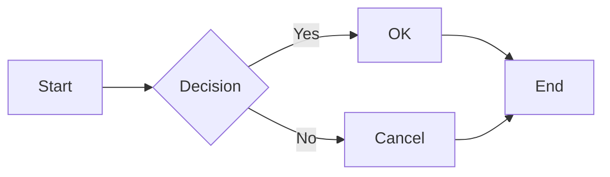

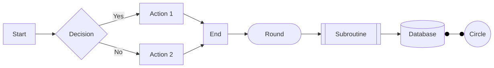

### Sequence Diagram

Sequence diagrams for modeling interactions between participants.

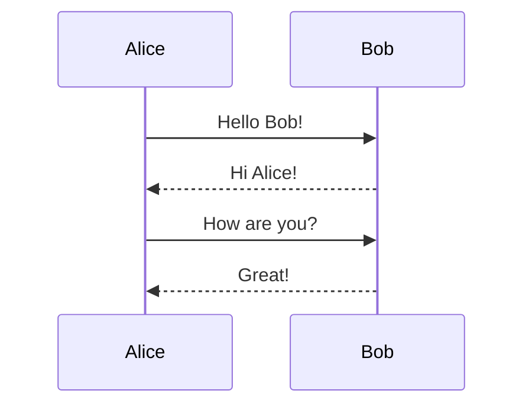

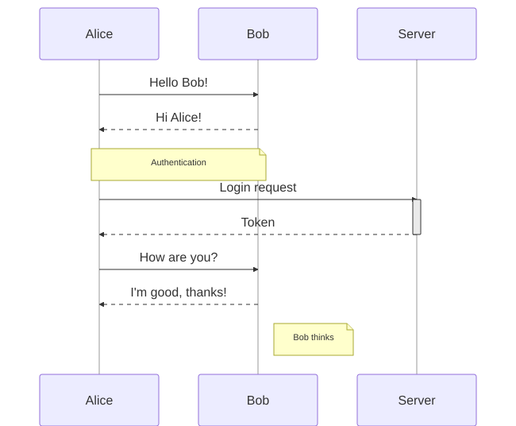

### Class Diagram

UML class diagrams showing relationships and structure.

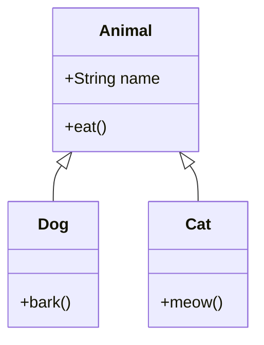

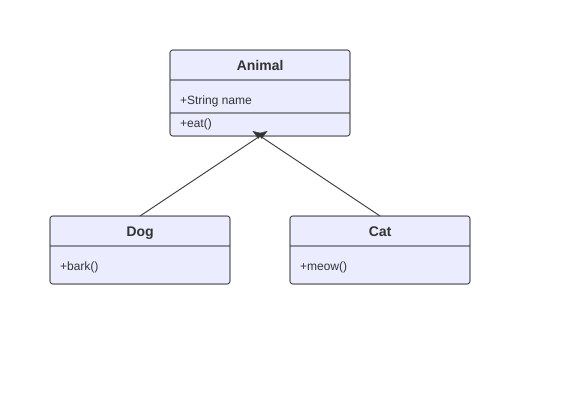

### State Diagram

State machine diagrams for modeling system states.

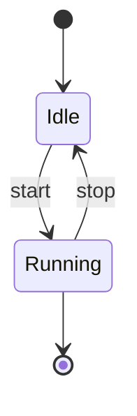

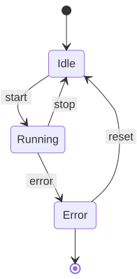

### Entity Relationship Diagram

ER diagrams for data modeling.

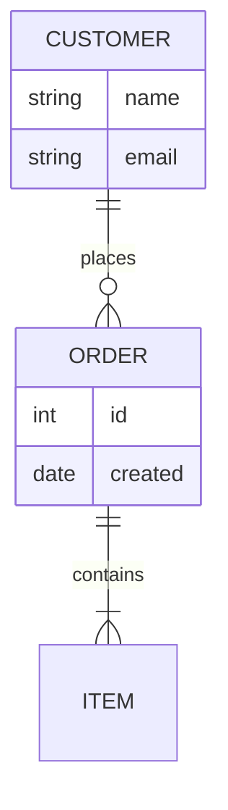

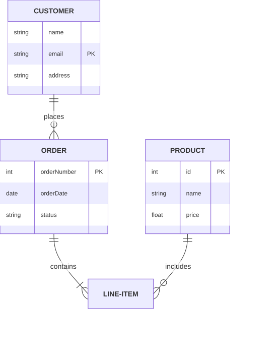

### Gantt Chart

Project timeline and scheduling charts.

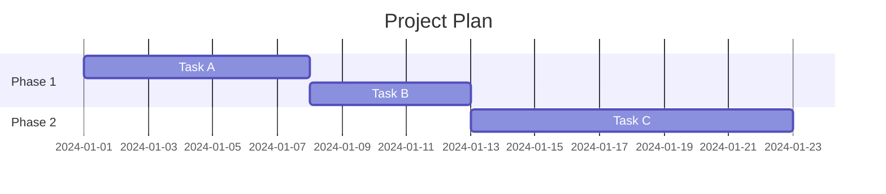

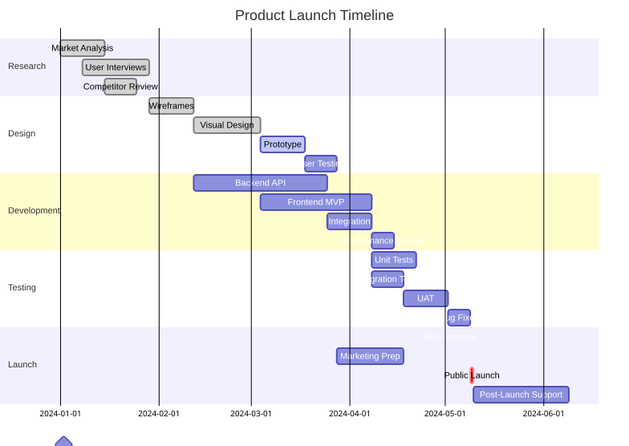

### Pie Chart

Pie charts for proportional data.

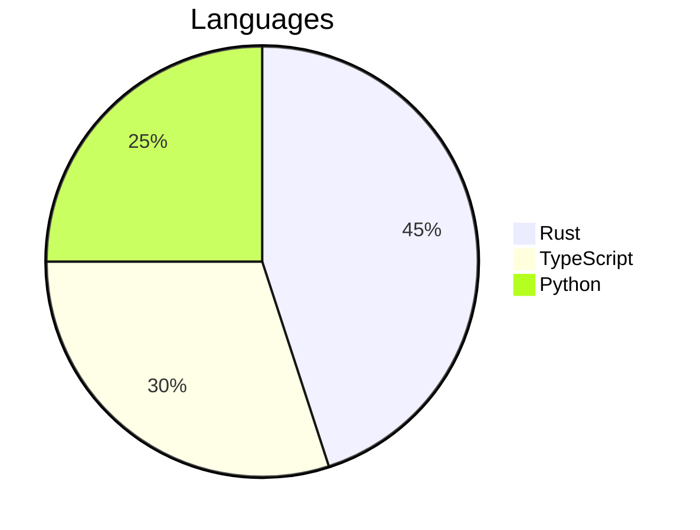

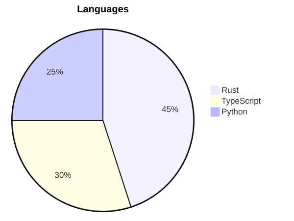

### Additional Diagram Types (Parser Only)

The following diagram types have parser support and rendering is in progress:

| Diagram Type | Description |
|--------------|-------------|
| Git Graph | Git branch visualization |
| Mindmap | Hierarchical mindmaps |
| Timeline | Timeline visualizations |
| Quadrant | Quadrant charts |
| XY Chart | Line and bar charts |
| Sankey | Flow diagrams with proportional widths |
| Requirement | Requirements diagrams |
| C4 | C4 architecture diagrams |
| Block | Block diagrams |
| Packet | Network packet diagrams |
| Kanban | Kanban boards |
| Architecture | Architecture diagrams |
| Journey | User journey maps |
| Radar | Radar/spider charts |
| Treemap | Treemap visualizations |

## Installation

```bash
cargo install selkie
```

Or build from source:

```bash
git clone https://github.com/btucker/selkie
cd selkie
cargo build --release
```

## Usage

### Command Line

```bash
# Render a diagram to SVG
selkie render -i diagram.mmd -o output.svg

# Shorthand (implicit render command)
selkie -i diagram.mmd -o output.svg

# Read from stdin, write to stdout
cat diagram.mmd | selkie -i - -o -

# Use a specific theme
selkie -i diagram.mmd -o output.svg --theme dark

# Output to PNG (requires 'png' feature)
selkie -i diagram.mmd -o output.png
```

### Evaluation System

Selkie includes a built-in evaluation system that compares output against Mermaid.js:

```bash
# Run evaluation with built-in samples
selkie eval

# Evaluate specific diagram types
selkie eval --type flowchart

# Generate HTML comparison report
selkie eval --html report.html

# Evaluate a directory of .mmd files
selkie eval ./diagrams/
```

The eval system performs:
- **Structural comparison** - Node/edge counts, labels, connections
- **Visual similarity** - SSIM-based image comparison
- **Report generation** - Text, JSON, and HTML outputs

### As a Library

```rust
use mermaid::{parse, render};

fn main() -> Result<(), Box<dyn std::error::Error>> {
    let diagram_source = r#"
        flowchart LR
            A[Start] --> B{Decision}
            B -->|Yes| C[OK]
            B -->|No| D[Cancel]
    "#;

    let diagram = parse(diagram_source)?;
    let svg = render(&diagram)?;

    println!("{}", svg);
    Ok(())
}
```

## Features

- `cli` - Command line interface (enabled by default)
- `png` - PNG output support via resvg
- `pdf` - PDF output support via svg2pdf
- `kitty` - Terminal image display for kitty/ghostty terminals
- `all-formats` - Enable all output formats

```bash
# Build with all features
cargo build --release --features all-formats
```

## Issue Tracking

This project uses [Beads](https://github.com/steveyegge/beads) for issue tracking - an AI-native issue tracker that lives directly in the repository. Issues are stored in `.beads/` and sync with git, making them accessible to both humans and AI coding agents.

```bash
# View available work
bd ready

# View issue details
bd show <issue-id>

# Update issue status
bd update <issue-id> --status in_progress
bd close <issue-id>

# Sync with remote
bd sync
```

## Development

This project follows test-driven development. Run the test suite:

```bash
cargo test
```

Run the evaluation to check parity with Mermaid.js:

```bash
cargo run -- eval
```

## License

MIT License - see [LICENSE](LICENSE) for details.

---

*Built with Claude Code*
